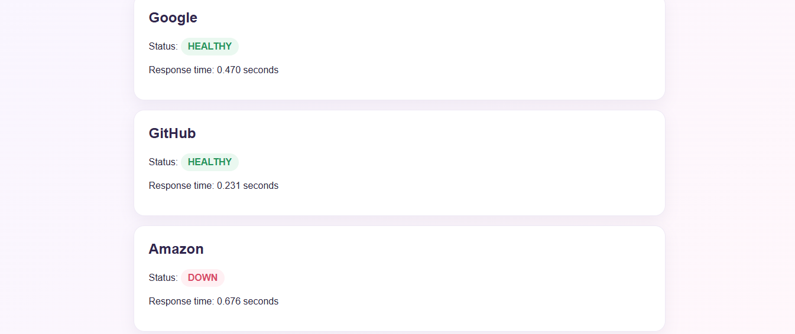

# ☁️ Cloud Health Monitor

A lightweight Python application that monitors the health and response time of major cloud and technology services.

## 🚀 Live Demo

https://cloud-health-monitor-1.onrender.com

## 📌 What It Does

Cloud Health Monitor checks whether selected services are reachable and reports:

- Service status (HEALTHY / DOWN)
- Response time
- Multiple services in one dashboard
- Last health check time
- Manual refresh capability

## 🖥️ Currently Monitored Services

- Google
- GitHub
- Amazon

## 🛠️ Technologies Used

- Python
- Requests
- Git & GitHub
- Environment Variables
- Virtual Environment (venv)
- Render
- HTTP Server

## ⚙️ How It Works

1. The application sends HTTP requests to each monitored service.
2. It measures the response time.
3. It determines whether the service is healthy or unavailable.
4. Results are displayed through a web dashboard.
5. The dashboard can be refreshed to perform another health check.
   
### 📊 Example Results

- Google — HEALTHY
- GitHub — HEALTHY
- Amazon — HEALTHY (HTTP 202)

Each health check displays the service status and response time.

### 🛠️ Troubleshooting & Improvements

During initial testing, Amazon was incorrectly reported as `DOWN` because the health-check logic only treated HTTP `200` responses as healthy. The health-check logic was updated to recognize successful HTTP responses in the `2xx–3xx` range.

After the update, Amazon returned **HTTP 202 (Accepted)** and was correctly identified as **HEALTHY**.

### 📁 Project Structure

```text
Cloud-Health-Monitor/
│
├── app.py
├── requirements.txt
├── DockerFile
├── README.md
├── .gitignore
└── .env
 ```

## 📊 Dashboard Preview

The dashboard provides a real-time overview of service health, response times, and availability across monitored cloud services.



